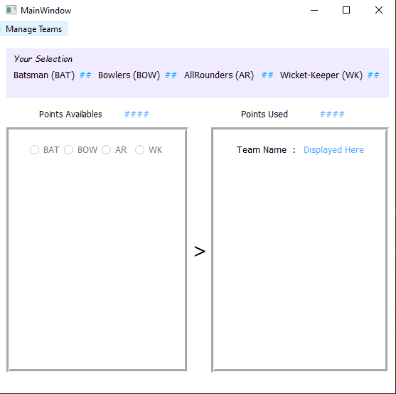
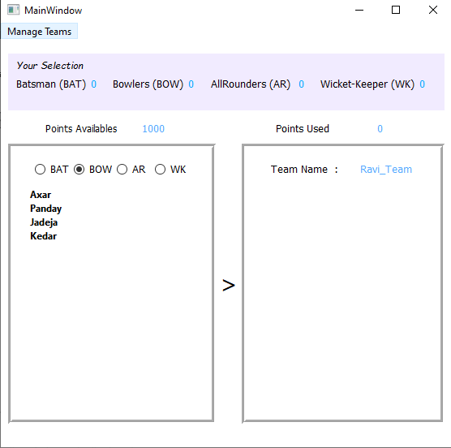
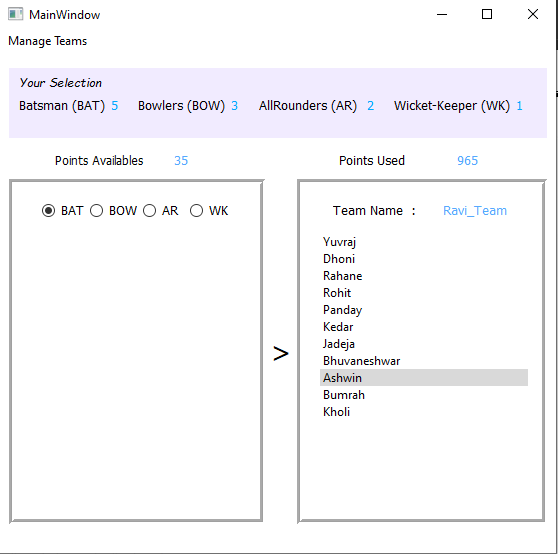
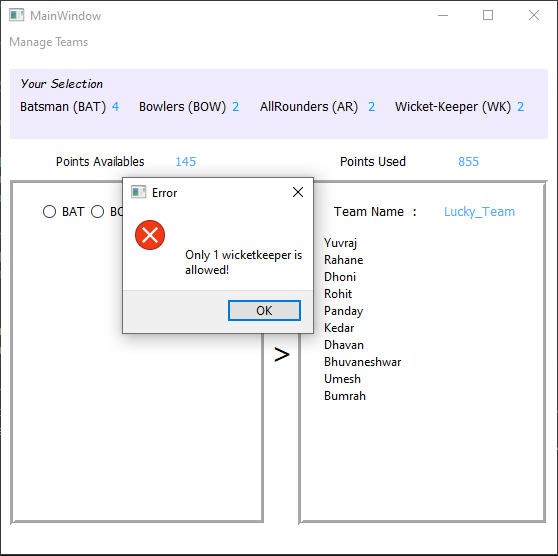
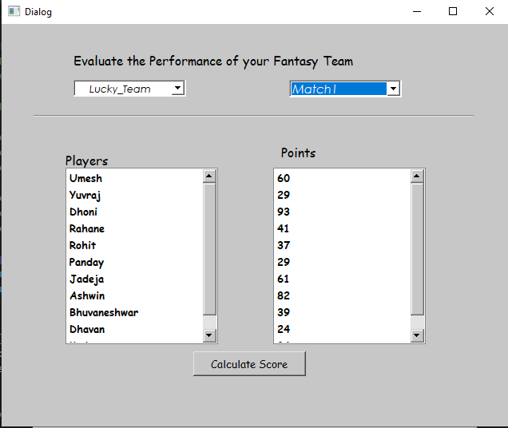
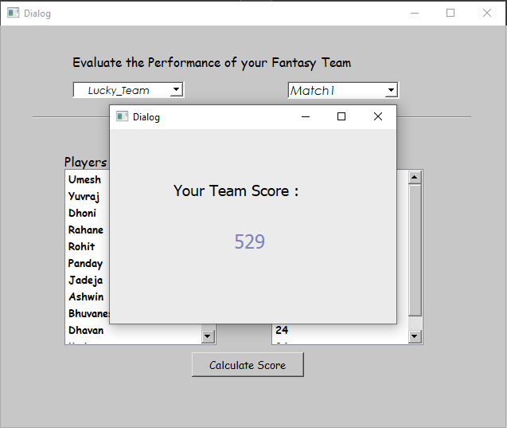

# Fantasy Cricket League Python Project

It is an game where you create a virtual team of real cricket players and score points. Depending on how your chosen players perform in real life matches. To win a tournament, you must try and get the maximum points and the No. 1 rank amongst other participants. 


## Overview
This is a Python-based project developed using:

- **Python**: for the application logic
- **QTDesigner**: for the User Interface (UI)
- **SQLite**: for database management
## Features

- Create and manage virtual cricket teams
- Calculate and update scores based on real match performances
- User-friendly graphical interface
- Persistent data storage using SQLite


## Requirements

1. **Python**: [Download Python](https://www.python.org/downloads/)
2. **SQLite**: 
   - [SQLite Tools (sqlite-tools-win32-x86-3340100)](https://www.sqlite.org/download.html)
   - [SQLiteStudio](https://sqlitestudio.pl/)
3. **PyQt GUI Toolkit**: 
   - [PyQt5 Tools](https://pypi.org/project/pyqt5-tools/)
   - [Direct Download](https://files.pythonhosted.org/packages/0e/a1/b2bbbb9e0c0f374fb77c85b014fc39fdb6e9e258c20906cc7ecb5f565e38/pyqt5_tools-5.9.0.1.2-cp36-none-win_amd64.whl)
## Installation

### Step 1: Install Python

Download and install Python from the [official website](https://www.python.org/downloads/).

### Step 2: Set Up SQLite

Download SQLite tools from the [SQLite official website](https://www.sqlite.org/download.html).

Install SQLiteStudio from [here](https://sqlitestudio.pl/).

### Step 3: Install PyQt5

Install PyQt5 using pip:
```bash
  pip3 install PyQt5
```
Download PyQt5 tools from the [direct link](https://files.pythonhosted.org/packages/0e/a1/b2bbbb9e0c0f374fb77c85b014fc39fdb6e9e258c20906cc7ecb5f565e38/pyqt5_tools-5.9.0.1.2-cp36-none-win_amd64.whl).
### Step 4: Database Integration in Python
To connect to the SQLite database in your Python file, use the following code:
```bash
import sqlite3
connection = sqlite3.connect('your_database_name.db')
```
### Step 5:Convert .ui to .py
To convert your QTDesigner .ui files to Python .py files, navigate to your Python installation directory and use the following command:
```bash
pyuic5 -x path_to_your_ui_file.ui -o output_python_file.py
```
For example:
```bash
cd C:\Users\Lucky\AppData\Local\Programs\Python\Python38
pyuic5 -x login.ui -o login.py
```
## Usage

1. **Run the Application**: Execute the main Python file to start the Fantasy Cricket League application.
2. **Create Teams**: Use the UI to create and manage your virtual cricket teams.
3. **Score Calculation**: The application will calculate and update scores based on real match performances.
## Screenshots

#### RESULT OF PYTHON PROJECT

1. **Opening Screen**: 
 You can see the players of each category by selecting the category. To begin with, the selection is disabled until a new team is created from the Manage Teams menu. A pop-up asking the name of the team appears.
   - 

2. **Toolbar Menu**: 
It allows you to create a new team, open an existing team, save your team, and finally evaluate the score of a saved team.
   - 

3. **New Team Selection**: 
After clicking New Team, the left box is populated with player names. As you select a different category, the corresponding list of players is displayed.
   - 

4. **Player Selection**: 
On double-clicking each player name, the right box gets populated. Points available and used are displayed accordingly.
   - 

5. **Game Logic Message**: 
Message if the game logic is not followed.
   - 

6. **Evaluate Score Pop-up**: 
Pop-up on clicking Evaluate Score. You can select your team here and the match for which the players' performance is compared.
   - 

7. **Final Score**: 
The final score for your fantasy team based on the match selected.
   - 


## Documentation

See the [Documentation](https://drive.google.com/file/d/1HPbOgW8LuOw4UV3JVCvhOIjrOSVqy8zW/view?usp=sharing).

